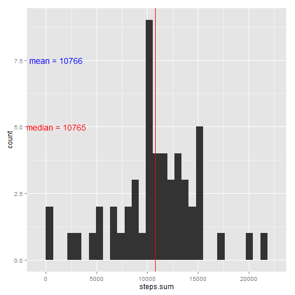
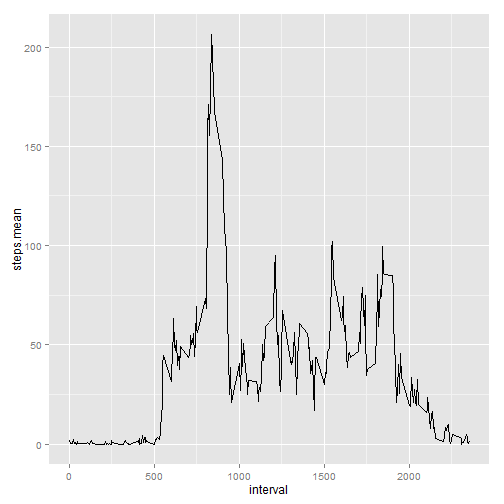
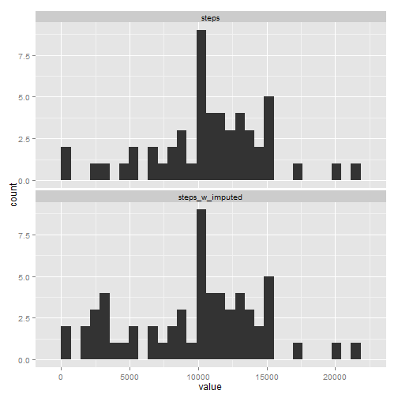
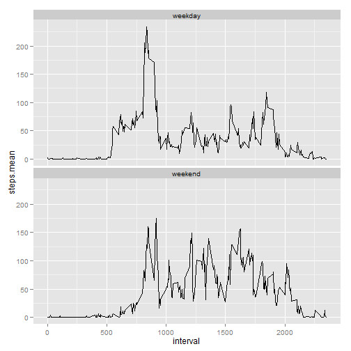

# Reproducible Research: Peer Assessment 1


## Preliminary

### Required Packages

Load packages that will be used.


```r
library(data.table)
library(ggplot2)
library(reshape)
```

```
## Loading required package: plyr
## 
## Attaching package: 'reshape'
## 
## The following objects are masked from 'package:plyr':
## 
##     rename, round_any
```


### Read Data

Unzip data file to current working directory and read-in data.  Format 'date' as class 'date' and steps as class 'numeric.'  Later we'll ask for the median value of steps over a set of features and time intervals, which cannot be expressed as an integer.


```r
unzip("activity.zip")
activity <- fread("activity.csv")
activity[, `:=`(date, as.Date(date, "%Y-%m-%d"))]
```

```
##        steps       date interval
##     1:    NA 2012-10-01        0
##     2:    NA 2012-10-01        5
##     3:    NA 2012-10-01       10
##     4:    NA 2012-10-01       15
##     5:    NA 2012-10-01       20
##    ---                          
## 17564:    NA 2012-11-30     2335
## 17565:    NA 2012-11-30     2340
## 17566:    NA 2012-11-30     2345
## 17567:    NA 2012-11-30     2350
## 17568:    NA 2012-11-30     2355
```

```r
activity[, `:=`(steps, as.numeric(steps))]
```

```
##        steps       date interval
##     1:    NA 2012-10-01        0
##     2:    NA 2012-10-01        5
##     3:    NA 2012-10-01       10
##     4:    NA 2012-10-01       15
##     5:    NA 2012-10-01       20
##    ---                          
## 17564:    NA 2012-11-30     2335
## 17565:    NA 2012-11-30     2340
## 17566:    NA 2012-11-30     2345
## 17567:    NA 2012-11-30     2350
## 17568:    NA 2012-11-30     2355
```


## Questions and Answers

### What is mean total number of steps taken per day?

First we aggregate the steps over the 5 min intervals by grouping steps by day.


```r
activity.daily <-
  activity[
    !is.na(steps), # redundant if '...na.rm = TRUE' used in sum
    list(
      steps.sum = sum(steps, na.rm = TRUE)
    ), 
    by = list(date)
  ]
head(activity.daily)
```

```
##          date steps.sum
## 1: 2012-10-02       126
## 2: 2012-10-03     11352
## 3: 2012-10-04     12116
## 4: 2012-10-05     13294
## 5: 2012-10-06     15420
## 6: 2012-10-07     11015
```


#### Make a histogram

Then we make a histogram of the daily steps along with vertical lines at the median and mean, daily steps.  From the annotation, the mean and median are nearly identical.  Therefore, the vertical line for median, which prints after the vertical line for mean, is the only line visible. 


```r
ggplot(activity.daily, aes(x = steps.sum)) + geom_histogram() + geom_vline(xintercept = mean(activity.daily$steps.sum, 
    na.rm = TRUE), color = "blue", position_jitter(width = 500, height = 500)) + 
    geom_vline(xintercept = median(activity.daily$steps.sum, na.rm = TRUE), 
        color = "red") + annotate("text", label = paste("mean = ", round(mean(activity.daily$steps.sum, 
    na.rm = TRUE)), sep = ""), x = 1000, y = 7.5, color = "blue") + annotate("text", 
    label = paste("median = ", round(median(activity.daily$steps.sum, na.rm = TRUE)), 
        sep = ""), x = 1000, y = 5, color = "red")
```

```
## stat_bin: binwidth defaulted to range/30. Use 'binwidth = x' to adjust this.
```

 


### What is the average daily activity pattern?

#### Make a time series plot (i.e. type = "l") of the 5-minute interval (x-axis) and the average number of steps taken, averaged across all days (y-axis)


```r
activity.interval <-
  activity[
    !is.na(steps),  # again, redundant but used for illustration 
    list(
      steps.mean = mean(steps, na.rm = TRUE)
    ), 
    by = list(interval)
  ]

head(activity.interval)
```

```
##    interval steps.mean
## 1:        0    1.71698
## 2:        5    0.33962
## 3:       10    0.13208
## 4:       15    0.15094
## 5:       20    0.07547
## 6:       25    2.09434
```

```r

ggplot(
  activity.interval,
  aes(interval, steps.mean)
) +
  geom_line()
```

 


#### Which 5-minute interval, on average across all the days in the dataset, contains the maximum number of steps?


```r
activity.interval[activity.interval[, which.max(steps.mean), ], ]
```

```
##    interval steps.mean
## 1:      835      206.2
```


### Imputing missing values

Note that there are a number of days/intervals where there are missing values (coded as NA). The presence of missing days may introduce bias into some calculations or summaries of the data.

#### Calculate and report the total number of missing values in the dataset (i.e. the total number of rows with NAs)


```r
activity[, sum(is.na(steps))]
```

```
## [1] 2304
```


#### Devise a strategy for filling in all of the missing values in the dataset. The strategy does not need to be sophisticated. For example, you could use the mean/median for that day, or the mean for that 5-minute interval, etc.

Unfortunately entire days are missing so standard methods of imputation like KNN won't be helpful.  Additionally, the data set is small (<< 60 samples of each interval's value - even less if features like 'day of week' are added) so learning models are not likely to yield robust imputation. 

To simplify, we mpute the missing values with the median steps for the same day of week and interval (if available) and the median steps for the interval (if not available).


```r

activity[, `:=`(dow, wday(date))]  # engineer 'day of week' feature
```

```
##        steps       date interval dow
##     1:    NA 2012-10-01        0   2
##     2:    NA 2012-10-01        5   2
##     3:    NA 2012-10-01       10   2
##     4:    NA 2012-10-01       15   2
##     5:    NA 2012-10-01       20   2
##    ---                              
## 17564:    NA 2012-11-30     2335   6
## 17565:    NA 2012-11-30     2340   6
## 17566:    NA 2012-11-30     2345   6
## 17567:    NA 2012-11-30     2350   6
## 17568:    NA 2012-11-30     2355   6
```

```r

impute_ref.dow.interval <- activity[!is.na(steps), list(dow_interval.steps.median = median(steps)), 
    by = list(dow, interval)]

head(impute_ref.dow.interval)
```

```
##    dow interval dow_interval.steps.median
## 1:   3        0                         0
## 2:   3        5                         0
## 3:   3       10                         0
## 4:   3       15                         0
## 5:   3       20                         0
## 6:   3       25                         0
```

```r

impute_ref.interval <- activity[!is.na(steps), list(interval.steps.median = median(steps)), 
    by = list(interval)]

head(impute_ref.interval)
```

```
##    interval interval.steps.median
## 1:        0                     0
## 2:        5                     0
## 3:       10                     0
## 4:       15                     0
## 5:       20                     0
## 6:       25                     0
```


#### Create a new dataset that is equal to the original dataset but with the missing data filled in.

If the data set was large and had many features (especially categorical) it would be bad practice to create an entirely new data set (replicating all common fields) just to store one more column of information.  Instead, I'll create a new column with the missing values imputed from the reference tables we created in the last section. 


```r

# data set is small but good practice to assign key values if using merge
setkeyv(activity, "dow")
setkeyv(activity, "interval")
setkeyv(impute_ref.dow.interval, "dow")
setkeyv(impute_ref.dow.interval, "interval")
setkeyv(impute_ref.interval, "interval")

# left join the reference tables for imputed values
activity <- merge(merge(activity, impute_ref.dow.interval, by = c("dow", "interval"), 
    all.x = TRUE), impute_ref.interval, by = c("interval"), all.x = TRUE)

head(activity)
```

```
##    interval dow steps       date dow_interval.steps.median
## 1:        0   1     0 2012-10-07                         0
## 2:        0   1     0 2012-10-14                         0
## 3:        0   1     0 2012-10-21                         0
## 4:        0   1     0 2012-10-28                         0
## 5:        0   1    NA 2012-11-04                         0
## 6:        0   1     0 2012-11-11                         0
##    interval.steps.median
## 1:                     0
## 2:                     0
## 3:                     0
## 4:                     0
## 5:                     0
## 6:                     0
```

```r

# select the desired value via daisy-chain
activity[, `:=`(steps_w_imputed, ifelse(is.na(steps), ifelse(is.na(dow_interval.steps.median), 
    interval.steps.median, dow_interval.steps.median), steps))]
```

```
##        interval dow steps       date dow_interval.steps.median
##     1:        0   1     0 2012-10-07                         0
##     2:        0   1     0 2012-10-14                         0
##     3:        0   1     0 2012-10-21                         0
##     4:        0   1     0 2012-10-28                         0
##     5:        0   1    NA 2012-11-04                         0
##    ---                                                        
## 17564:     2355   7     0 2012-10-27                         0
## 17565:     2355   7     0 2012-11-03                         0
## 17566:     2355   7    NA 2012-11-10                         0
## 17567:     2355   7     0 2012-11-17                         0
## 17568:     2355   7     0 2012-11-24                         0
##        interval.steps.median steps_w_imputed
##     1:                     0               0
##     2:                     0               0
##     3:                     0               0
##     4:                     0               0
##     5:                     0               0
##    ---                                      
## 17564:                     0               0
## 17565:                     0               0
## 17566:                     0               0
## 17567:                     0               0
## 17568:                     0               0
```

```r

head(activity)
```

```
##    interval dow steps       date dow_interval.steps.median
## 1:        0   1     0 2012-10-07                         0
## 2:        0   1     0 2012-10-14                         0
## 3:        0   1     0 2012-10-21                         0
## 4:        0   1     0 2012-10-28                         0
## 5:        0   1    NA 2012-11-04                         0
## 6:        0   1     0 2012-11-11                         0
##    interval.steps.median steps_w_imputed
## 1:                     0               0
## 2:                     0               0
## 3:                     0               0
## 4:                     0               0
## 5:                     0               0
## 6:                     0               0
```

```r

# delete joined columns no longer in use
activity[, `:=`(dow_interval.steps.median, NULL)]
```

```
##        interval dow steps       date interval.steps.median steps_w_imputed
##     1:        0   1     0 2012-10-07                     0               0
##     2:        0   1     0 2012-10-14                     0               0
##     3:        0   1     0 2012-10-21                     0               0
##     4:        0   1     0 2012-10-28                     0               0
##     5:        0   1    NA 2012-11-04                     0               0
##    ---                                                                    
## 17564:     2355   7     0 2012-10-27                     0               0
## 17565:     2355   7     0 2012-11-03                     0               0
## 17566:     2355   7    NA 2012-11-10                     0               0
## 17567:     2355   7     0 2012-11-17                     0               0
## 17568:     2355   7     0 2012-11-24                     0               0
```

```r
activity[, `:=`(interval.steps.median, NULL)]
```

```
##        interval dow steps       date steps_w_imputed
##     1:        0   1     0 2012-10-07               0
##     2:        0   1     0 2012-10-14               0
##     3:        0   1     0 2012-10-21               0
##     4:        0   1     0 2012-10-28               0
##     5:        0   1    NA 2012-11-04               0
##    ---                                              
## 17564:     2355   7     0 2012-10-27               0
## 17565:     2355   7     0 2012-11-03               0
## 17566:     2355   7    NA 2012-11-10               0
## 17567:     2355   7     0 2012-11-17               0
## 17568:     2355   7     0 2012-11-24               0
```


#### Make a histogram of the total number of steps taken each day and Calculate and report the mean and median total number of steps taken per day. Do these values differ from the estimates from the first part of the assignment? What is the impact of imputing missing data on the estimates of the total daily number of steps?


```r

# daily steps for both original and original with imputed values
activity.daily <- activity[, list(steps = sum(steps, na.rm = FALSE), steps_w_imputed = sum(steps_w_imputed, 
    na.rm = FALSE)), by = list(date)]

head(activity.daily)
```

```
##          date steps steps_w_imputed
## 1: 2012-10-07 11015           11015
## 2: 2012-10-14 15098           15098
## 3: 2012-10-21  8821            8821
## 4: 2012-10-28 11458           11458
## 5: 2012-11-04    NA            2723
## 6: 2012-11-11 12608           12608
```

```r

# melt table so that metrics become factors
activity.daily <- data.table(melt(activity.daily, id.vars = c("date")))


# make panel of histogram to compare impact of imputation
ggplot(activity.daily, aes(x = value)) + geom_histogram() + facet_wrap(~variable, 
    ncol = 1)
```

```
## stat_bin: binwidth defaulted to range/30. Use 'binwidth = x' to adjust this.
## stat_bin: binwidth defaulted to range/30. Use 'binwidth = x' to adjust this.
```

 

```r


# calc mean and median daily steps by factor
activity.daily.stats <- rbind(data.table(ignore.na = TRUE, activity.daily[, 
    list(steps.mean = mean(value, na.rm = TRUE), steps.median = median(value, 
        na.rm = TRUE)), by = list(variable)]), data.table(ignore.na = FALSE, 
    activity.daily[, list(steps.mean = mean(value, na.rm = FALSE), steps.median = median(value, 
        na.rm = FALSE)), by = list(variable)]))

activity.daily.stats
```

```
##    ignore.na        variable steps.mean steps.median
## 1:      TRUE           steps      10766        10765
## 2:      TRUE steps_w_imputed       9705        10395
## 3:     FALSE           steps         NA           NA
## 4:     FALSE steps_w_imputed       9705        10395
```


### Are there differences in activity patterns between weekdays and weekends? 


#### Create a new factor variable in the dataset with two levels – “weekday” and “weekend” indicating whether a given date is a weekday or weekend day


```r

# leverage 'dow' field already engineered
activity[, `:=`(day_type, ifelse(((dow == 1) | (dow == 7)), "weekend", "weekday"))]
```

```
##        interval dow steps       date steps_w_imputed day_type
##     1:        0   1     0 2012-10-07               0  weekend
##     2:        0   1     0 2012-10-14               0  weekend
##     3:        0   1     0 2012-10-21               0  weekend
##     4:        0   1     0 2012-10-28               0  weekend
##     5:        0   1    NA 2012-11-04               0  weekend
##    ---                                                       
## 17564:     2355   7     0 2012-10-27               0  weekend
## 17565:     2355   7     0 2012-11-03               0  weekend
## 17566:     2355   7    NA 2012-11-10               0  weekend
## 17567:     2355   7     0 2012-11-17               0  weekend
## 17568:     2355   7     0 2012-11-24               0  weekend
```

```r

head(activity)
```

```
##    interval dow steps       date steps_w_imputed day_type
## 1:        0   1     0 2012-10-07               0  weekend
## 2:        0   1     0 2012-10-14               0  weekend
## 3:        0   1     0 2012-10-21               0  weekend
## 4:        0   1     0 2012-10-28               0  weekend
## 5:        0   1    NA 2012-11-04               0  weekend
## 6:        0   1     0 2012-11-11               0  weekend
```


#### Make a panel plot containing a time series plot (i.e. type = "l") of the 5-minute interval (x-axis) and the average number of steps taken, averaged across all weekday days or weekend days (y-axis). See the README file in the GitHub repository to see an example of what this plot should look like using simulated data.


```r

# using original data set without imputed values since it wasn't clear which
# one to use
activity.day_type.interval <- activity[!is.na(steps), list(steps.mean = mean(steps, 
    na.rm = TRUE)), by = list(day_type, interval)]

head(activity.day_type.interval)
```

```
##    day_type interval steps.mean
## 1:  weekend        0     0.0000
## 2:  weekday        0     2.3333
## 3:  weekend        5     0.0000
## 4:  weekday        5     0.4615
## 5:  weekend       10     0.0000
## 6:  weekday       10     0.1795
```

```r

# plot results
ggplot(activity.day_type.interval, aes(interval, steps.mean)) + geom_line() + 
    facet_wrap(~day_type, ncol = 1)
```

 

